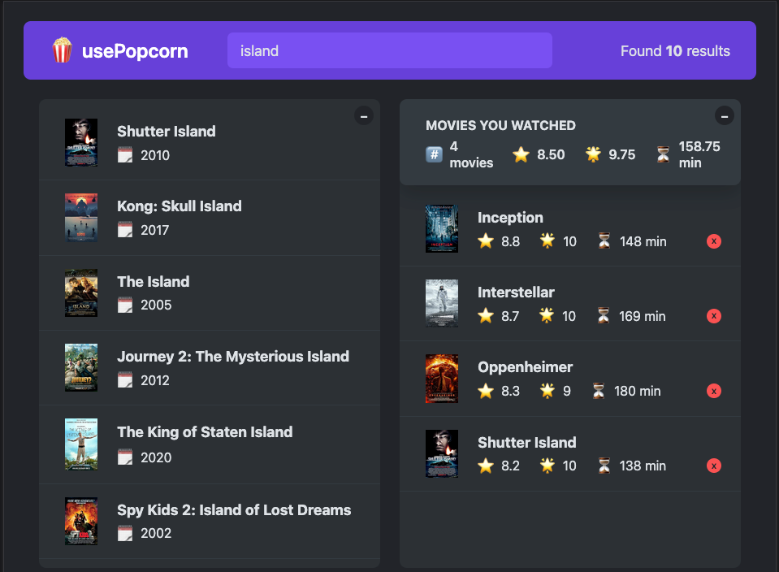

# 🍿 usePopcorn

A React application for searching movies and tracking your personal watchlist with ratings.



## 📋 Features

- Search movies using the OMDB API
- View detailed movie information including plot, runtime, genre, and IMDB rating
- Add movies to your personal watchlist
- Rate movies on a 1-10 star scale
- Track your average ratings and watch statistics
- Persistent storage of your watchlist using localStorage
- Responsive design with collapsible panels

## 🚀 Getting Started

### Prerequisites

- Node.js (v12.0.0 or higher)
- npm (v6.0.0 or higher)
- OMDB API key (get one at [omdbapi.com](https://www.omdbapi.com/))

### Installation

1. Clone the repository:

   ```bash
   git clone https://github.com/shubhs27/usepopcorn.git
   cd usepopcorn
   ```

2. Install dependencies:

   ```bash
   npm install
   ```

3. Create a `.env` file in the root directory and add your OMDB API key:

   ```
   REACT_APP_API_KEY=your_omdb_api_key
   ```

4. Start the development server:

   ```bash
   npm start
   ```

5. Open [http://localhost:3000](http://localhost:3000) to view the app in your browser.

## 📦 Custom Hooks

### useMovies

Handles fetching and filtering movie data from the OMDB API.

```jsx
const { movies, isLoading, error } = useMovies(query);
```

### useLocalStorageState

Manages state that persists in localStorage.

```jsx
const [watched, setWatched] = useLocalStorageState([], "watched");
```

### useKey

Listens for keyboard events and executes callbacks.

```jsx
useKey("Escape", handleCloseMovie);
```

## 🎨 Components

### MovieList & Movie

Displays the list of searchable movies.

### MovieDetails

Shows detailed information about a selected movie.

### WatchedMoviesList & WatchedMovie

Displays the user's watchlist with their ratings.

### StarRating

A reusable rating component that can be customized with different colors, sizes, and maximum ratings.

## 🧠 Key Concepts Demonstrated

- Custom React hooks
- useEffect for data fetching and side effects
- useState for component state management
- useRef for DOM references
- Prop drilling and component composition
- Conditional rendering
- React portals (for modal dialogs)
- Derived state from props
- Error handling in async operations
- Cleanup functions in useEffect

## 📱 Responsive Design

The application is designed to work on various screen sizes:

- Desktop: Full two-panel layout
- Tablet: Adjustable panels
- Mobile: Stacked layout with collapsible sections

## 🙏 Acknowledgments

- [OMDB API](https://www.omdbapi.com/) for movie data
- This project is part of Jonas Schmedtmann's Udemy course - The Ultimate React Course 2025
- All assets and UI components are inspired by the course material.
